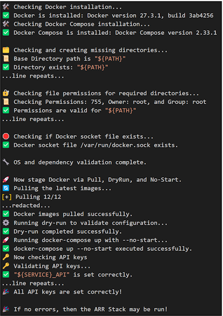

# arr-stack

<b>This repository is intended to run only on Linux!</b>

This arr-stack simplifies the setup of a Dockerized media automation stack. It combines various components like Sonarr, Radarr, and other media management tools to automate downloading, organizing, and renaming media. This project aims to streamline the configuration of Docker containers for managing media content efficiently.

## Features
- Easy setup with a pre-configured `docker-compose.yaml`.
- Integrated with popular media automation tools like Sonarr and Radarr.
- `.env` file for flexible environment variables.
- Automated setup script (`setup.sh`) for quick deployment.

## Requirements
- Docker & Docker Compose
- Basic understanding of Docker container management.

## Installation

1. Clone the repository:
   ```bash
   git clone https://github.com/Artalius/arr-stack.git
   cd arr-stack
   ```

2. Configure environment variables:
   - Edit the `.env` file with your settings.
   - Services requiring API key 
     - yes a catch-22, unless you are Migrating/Unifying
     - SH will warn you if not set (useful for re-runs), but will not prevent a full run of step 4
       - [Doplarr](https://github.com/kiranshila/Doplarr)
       - [BAZARR](https://github.com/morpheus65535/bazarr)
       - [LIDARR](https://github.com/lidarr/Lidarr)
       - [OVERSEERR](https://github.com/sct/Overseerr)
       - [RADARR](https://github.com/Radarr/Radarr)
       - [READARR](https://github.com/Readarr/Readarr)
       - [SONARR](https://github.com/Sonarr/Sonarr)
       - [WHISPARR](https://github.com/Whisparr/Whisparr)

3. Run the setup script:
   ```bash
   ./setup.sh
   ```
<details><summary>Sample Run  </summary>
   


</details>

4. Start the stack:
   ```bash
   docker-compose up -d
   ```

## Contributing

Feel free to fork and submit pull requests. Any improvements or bug fixes are always appreciated.
